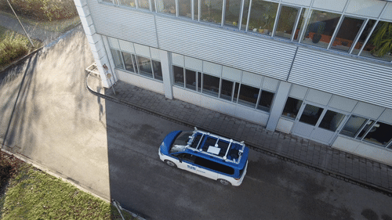

# Repair-to-Drive: Traffic-Rule-Compliant Trajectory Repair 

This repository contains the implementation for the TRO paper "Traffic-Rule-Compliant Trajectory Repair via Satisfiability Modulo Theories and Reachability Analysis".<br>


## 🚗 About Trajectory Repair

<sub>_Inspired by Randall Munroe, I describe my research using the 1,200 most common English words from [www.wordfrequency.info](www.wordfrequency.info)._</sub>  

We want cars to always plan a safe path. But the world around us changes all the time. So sometimes the planned path cannot be followed safely, or it breaks traffic rules. One possible solution is to **keep the safe part of the path** and **replan the rest**.

---
## ⚙️ Requirements

- **Python**: 3.10  
- **OS**: Ubuntu 20.04 or 22.04 (tested)  

---

## 📦 Installation Guide

We recommend using [Anaconda](https://www.anaconda.com/) to manage your environment so that even if you mess something up, you can always have a safe and clean restart. A guide for managing python environments with Anaconda can be found [here](https://conda.io/projects/conda/en/latest/user-guide/tasks/manage-environments.html).

After installing Anaconda, create a new environment with:

``` sh
conda create -n repairverse python=3.10 -y
```

Here the name of the environment is called **repairverse**. You may also change this name as you wish. In such case, don't forget to change it in the following commands as well. **Always activate** this environment before you do anything related:

```sh
conda activate repairverse
```

You have to manually install the following packages:

* [commonroad-stl-monitor](https://github.com/CommonRoad/commonroad-stl-monitor): branch `feature/repair-all`
  (if `rtamt` is not installed successfully, you need to update the submodules with `git submodule init` and `git submodule update`
* [commonroad-mpr](https://github.com/CommonRoad/commonroad-mpr): branch `feature/repair-all`
* commonroad-reach-sementic: *coming soon*
> ⚠️ **Note**  
> The currently available constraints for repair are **manually defined in the solution space**, not in the reachability analysis. See:  
> ```python
> config.repair.constraint_mode = 1
> ```
```sh
# Clone the repository and switch to the desired branch
git clone --recurse-submodules <package_url>
cd <package_folder>
git checkout <branch_name>

# Install the package in editable mode
pip install -e .

# get back to the main folder
cd ..
```

Then, install the dependencies in this repository with:

```sh
git clone https://github.com/CommonRoad/repair-to-drive
cd repair-to-drive
pip install -r requirements.txt
```

This will install related dependencies specified in `requirements.txt`. Or simply install the dependencies listed in `requirements.txt` and add this repository to your python path.

Finally, install this commonroad-repairer package:

```sh
pip install -e .
```
---
### 🪪 Optimization license

For using the optimization solvers, e.g., Gurobi, it is required to apply for an academic license:

* Gurobi: <https://www.gurobi.com/academia/academic-program-and-licenses/>
  * `conda install -c gurobi gurobi`
  * `connect to the campus network/use` [eduVPN](https://docs.eduvpn.org/client/linux/installation.html)
  * `grbgetkey xxx` (obtained from the Gurobi website)
---
## 📂 Folder structure

```sh
commonroad-repairer 
├─ config                               # Configurations for traffic rules and QP planner                                        
├─ crrepairer
│  ├─ cut_off                           # Detecting cut-off states 
|  ├─ miqp_planner                      # MIQP solver for finding the repaired trajectories.                           
│  ├─ repairer                          # Satisfiability modulo theories-based trajectory repairer
|  ├─ smt 
│     ├─ sat_solver                     # SATisfiability solver (DPLL algorirthm-based)
│     ├─ t_solver                       # Theory solver
|     ├─ monitor_wrapper                # Wrapper for traffic rule monitor
│  ├─ utils                             # Utility functions
├─ scenarios
├─ example_*
├─ LICENSE.txt                                       
├─ README.md   
├─ requirements.txt
└─ setup.py                                      
```

> **IMPORTANT!**
>
> **Error**: `RuntimeError: New dt is not a multiple of obstacle dt`
> 
> **Solution**: You need to use the `TkAgg` backend instead of `QtAgg`.
> 
> Here's how to check the current backend and switch to `TkAgg`:
> ```python
> import matplotlib
> print(matplotlib.get_backend())  # Check the current backend
> matplotlib.use('TkAgg')          # Set the backend to TkAgg
> ```
---
## ▶️ Minimal Example

You can find example scripts in the files named `example_*`.


## 📖 Citation

```text
@article{ lin2025rule,
  author={Yuanfei Lin and Zekun Xing and Xuyuan Han and Matthias Althoff},
  journal = {IEEE Trans. on Robotics},
  title = {Traffic-Rule-Compliant Trajectory Repair via Satisfiability Modulo Theories and Reachability Analysis},
  year = {2025}
}
```
```text
@inproceedings{ lin2022repair,
    author = {Lin, Yuanfei and  Althoff, Matthias},
    title = {Rule-Compliant Trajectory Repairing using Satisfiability Modulo Theories},
    booktitle = {2022 IEEE Intelligent Vehicles Symposium (IV)},
    year = {2022},
    pages = {449-456},
    doi = {10.1109/IV51971.2022.9827357},
    url = {https://ieeexplore.ieee.org/document/9827357},
}
```
